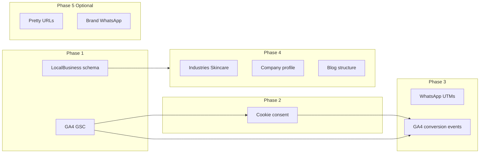

# Full plan: remaining scope gaps implementation

## Prerequisites (client to provide)

- **GA4 Measurement ID** (e.g. `G-XXXXXXXXXX`) for analytics and conversion events.
- **Google Search Console verification** meta tag or HTML file (verification string).
- **Company profile PDF** (single file) to host for "Download company profile" CTA. If not ready, use a placeholder path and document where to replace it.

Config will use `.env` for `GA4_MEASUREMENT_ID` and `GSC_VERIFICATION` so no secrets are committed.

---

## Phase 1: Analytics, verification, and schema

### 1.1 GA4 and Google Search Console

- **File:** [includes/head.php](includes/head.php)  
  - After charset/viewport, add optional GSC verification meta tag when `GSC_VERIFICATION` is set (e.g. `<meta name="google-site-verification" content="...">`).
  - Before `</head>`, add GA4 gtag script when `GA4_MEASUREMENT_ID` is set: global site tag (gtag.js) plus config call. Load from `https://www.googletagmanager.com/gtag/js?id=G-XXX` and call `gtag('config', 'G-XXX')`.
- **File:** [includes/config.php](includes/config.php)  
  - Read `GA4_MEASUREMENT_ID` and `GSC_VERIFICATION` from `$_ENV`/getenv (with empty string default).
- **File:** [.env.example](.env.example)  
  - Add placeholders: `GA4_MEASUREMENT_ID=`, `GSC_VERIFICATION=`.

### 1.2 Local Business structured data

- **File:** [includes/seo.php](includes/seo.php)  
  - Keep existing Organization JSON-LD.
  - Add a second JSON-LD block for **LocalBusiness** (or Organization + LocalBusiness): same name, url, logo, description, address (PostalAddress), telephone, email; optionally `openingHours` if client provides. Use schema.org/LocalBusiness so Search can show business info in results.

No other files need changes for Phase 1.

---

## Phase 2: Cookie consent

### 2.1 Cookie consent banner and preference

- **New file:** `includes/cookie-consent.php`  
  - Output a fixed banner (e.g. bottom or top) with short message, "Accept" and "Decline" (or "Preferences"). Link to [public/privacy-policy.php](public/privacy-policy.php) for cookie details.
  - Use `localStorage` (e.g. key `cookie_consent`) to remember choice; hide banner once set. Optionally set a cookie for server-side use.
  - Minimal inline CSS/JS or reuse Tailwind; no new dependencies. Ensure banner is visible in both light and dark mode.
- **File:** [includes/page-end.php](includes/page-end.php)  
  - Include `cookie-consent.php` before footer (or right after `<body>` content, before `</body>`).
- **File:** [includes/head.php](includes/head.php)  
  - Only load GA4 gtag when consent is "accept" (or equivalent). Options: (A) load GA4 after consent via JS, or (B) load GA4 always but document that client should configure consent mode in GA4. Plan recommends (A): inject gtag script only after user accepts.

Implementation detail: if consent not yet given, do not output the GA4 script in head; after "Accept", set consent flag and dynamically load gtag and run config. This satisfies "cookie consent management" and keeps analytics consent-aware.

---

## Phase 3: Conversion tracking and WhatsApp UTMs

### 3.1 WhatsApp links with UTM parameters

- **File:** [includes/whatsapp-cta.php](includes/whatsapp-cta.php)  
  - Build `$waUrl` as base `wa.me/...`; append query string with `utm_source=website`, `utm_medium=whatsapp`, `utm_campaign=cta` (and optional `utm_content=floating`). Use `http_build_query` or manual concatenation; ensure number stays correct.
- **File:** [includes/footer.php](includes/footer.php)  
  - Replace hardcoded `https://wa.me/923215707070` with a PHP variable or shared helper. Reuse same UTM params (e.g. `utm_content=footer`).
- **File:** [public/contact.php](public/contact.php)  
  - Replace hardcoded WhatsApp link with same UTM-building logic (e.g. `utm_content=contact_page`).

Optional: add `$waUtmParams` in config or a small helper so all three places use one definition.

### 3.2 Conversion tracking (GA4 events)

- **File:** [includes/head.php](includes/head.php) or a new include included from head  
  - Only when GA4 is loaded (and after consent if Phase 2 is implemented), ensure `gtag` is available on window.
- **Form submit (contact):**  
  - In [includes/contact-form.php](includes/contact-form.php) (or the form’s page), add inline script: on form submit (before or after POST), call `gtag('event', 'form_submit', { form_name: 'contact_inquiry' });` if `gtag` is defined. Form posts to [public/send-inquiry.php](public/send-inquiry.php); event should fire on the page that contains the form (contact.php) so use `onsubmit` or a small script there.
- **Thank-you page:**  
  - On [public/contact.php](public/contact.php), when `$_GET['sent'] === '1'`, output a small inline script that fires `gtag('event', 'generate_lead')` (or a custom event) once. This covers server-side redirects after successful submit.
- **Phone and email clicks:**  
  - In [public/contact.php](public/contact.php), add `onclick` (or data attributes + delegated handler) on `tel:` and `mailto:` links to send GA4 events (e.g. `contact`, action `click_phone` / `click_email`). Same for footer phone/email in [includes/footer.php](includes/footer.php) if those links exist.

No backend changes required in send-inquiry.php for tracking; all events are client-side.

---

## Phase 4: Content and SEO

### 4.1 Industries page: Skincare & Cosmetics (and Retail & Gifting)

- **File:** [public/industries.php](public/industries.php)  
  - Add a dedicated section or card for **Skincare & Cosmetics** (industry-specific copy and visual block, consistent with existing FMCG / Food & Beverage / Construction blocks).
  - Align **Retail & Gifting** with doc: either rename "Retail Spaces" to "Retail & Gifting" or add "Gifting" to the copy and ensure one clear block for this segment.
  - Preserve existing structure (grid, headings, links to capabilities/brands) and responsive layout.

### 4.2 Company profile download

- **Asset:** Add a placeholder or real PDF under `public/assets/` or `public/downloads/` (e.g. `company-profile.pdf`). Document in README that client should replace with final PDF.
- **Config:** In [includes/config.php](includes/config.php) (or a single place), define a constant or variable for the company profile URL (e.g. `COMPANY_PROFILE_URL` or from env).
- **CTA placement:**  
  - Add a "Download company profile" button or link on [public/contact.php](public/contact.php) (e.g. in the contact info or above/below the form) and optionally in [public/leadership.php](public/leadership.php) or footer. Link to the PDF with `download` attribute; open in new tab if preferred.
- **File:** [.env.example](.env.example)  
  - Optional: `COMPANY_PROFILE_URL=/assets/company-profile.pdf` (or leave path hardcoded in config).

### 4.3 Blog / content structure

- **New:** `public/blog/` directory.
- **New:** `public/blog/index.php`  
  - Blog index page: title "Blog" (or "Insights"), meta description, optional hero, list of posts (initially empty or 1–2 placeholder posts). Use same layout (page-start, header, footer, page-end).
- **New:** `public/blog/post.php` (or `public/blog/single.php`)  
  - Single post template: accept `?id=slug` or use a single placeholder slug; show title, date, body (hardcoded or from a simple array). No database required for MVP; structure only.
- **Navigation:** Add "Blog" or "Insights" link in [includes/header.php](includes/header.php) and [includes/footer.php](includes/footer.php).
- **Sitemap:** Add blog index and placeholder post URLs to [public/sitemap.xml](public/sitemap.xml) with appropriate priority/changefreq.

---

## Phase 5: Optional enhancements

### 5.1 SEO-friendly (pretty) URLs

- **File:** Create or update `public/.htaccess` (or document root `.htaccess` that routes to public).  
  - Rewrite rules: e.g. `/capabilities` -> `capabilities.php`, `/industries` -> `industries.php`, `/contact` -> `contact.php`, `/leadership` -> `leadership.php`, `/certifications` -> `certifications.php`, `/projects` -> `projects.php`, `/brands` -> `brands.php`, `/privacy-policy` -> `privacy-policy.php`, `/terms` -> `terms.php`.  
  - Preserve existing `brands/*` and `blog/*` routing.  
  - Root `/` -> `index.php`.
- **Internal links:** Update all internal links site-wide (header, footer, in-page links) from `capabilities.php` to `/capabilities` (and similarly for others) so canonical and UX match. Many files: [includes/header.php](includes/header.php), [includes/footer.php](includes/footer.php), [public/index.php](public/index.php), all brand and main pages.
- **Canonicals and sitemap:** [includes/seo.php](includes/seo.php) and [public/sitemap.xml](public/sitemap.xml) already use full URLs; ensure canonical and sitemap use the pretty path (e.g. `https://binnaeemindustries.com/capabilities`) once rewrites are live.

### 5.2 Brand-specific WhatsApp (optional)

- Only if client provides per-brand numbers: in [includes/config.php](includes/config.php) (or .env) define an array or map of brand slug -> number. In [includes/whatsapp-cta.php](includes/whatsapp-cta.php) and any brand page that includes the CTA, pass `$whatsappNumber` from the current brand; otherwise fall back to default. Add UTM to brand-specific links (e.g. `utm_content=brand_naeem_packages`). No change if client keeps single number.

### 5.3 Testimonials and keyword docs

- **Testimonials:** No code change for "real testimonial integration"; when client provides real quotes/names/roles, replace placeholder content in [public/index.php](public/index.php) (testimonials carousel section) manually or via a small CMS later.
- **Keyword list / mapping:** Add a markdown or text file under `docs/seo-keywords.md` (or similar) as a placeholder for "keyword list per brand" and "keyword mapping sheet" deliverable; client or SEO fills it. Optional: link from README.

---

## Phase 6: Documentation and deployment

### 6.1 README and deployment docs

- **File:** [README.md](README.md)  
  - Add short sections: Analytics (GA4/GSC env vars), Cookie consent (what the banner does), Company profile (where to put PDF and env/config), Blog (where to add posts or plug in CMS later). Mention that reporting (monthly SEO, PageSpeed, etc.) is done outside the repo.
- **File:** [CPANEL_DEPLOYMENT.md](CPANEL_DEPLOYMENT.md)  
  - Note that for pretty URLs, `.htaccess` in document root must include the rewrite rules (or point to public/.htaccess). List any new env vars (GA4, GSC, company profile path if used).

---

## Implementation order and dependencies

- Phase 1 first (analytics + schema); then Phase 2 (consent) so GA4 can be gated by consent.
- Phase 3 (UTMs + events) after GA4 and consent are in place.
- Phase 4 can run in parallel after Phase 1 (no dependency on consent).
- Phase 5 and 6 can be done last or in parallel.

---

## Files to create

| File                                                                          | Purpose                                          |
| ----------------------------------------------------------------------------- | ------------------------------------------------ |
| `includes/cookie-consent.php`                                                 | Cookie banner + accept/decline + consent storage |
| `public/blog/index.php`                                                       | Blog listing page                                |
| `public/blog/post.php` or `single.php`                                        | Single post template                             |
| `public/assets/company-profile.pdf` or `public/downloads/company-profile.pdf` | Placeholder PDF (replace with real)              |
| `docs/seo-keywords.md`                                                        | Optional placeholder for keyword list/mapping    |
| `public/.htaccess`                                                            | Optional rewrites for pretty URLs                |

---

## Files to modify

| File                                                                  | Changes                                                                            |
| --------------------------------------------------------------------- | ---------------------------------------------------------------------------------- |
| [includes/head.php](includes/head.php)                                | GSC meta, GA4 gtag (consent-gated if Phase 2 done), schema stays                   |
| [includes/config.php](includes/config.php)                            | GA4_MEASUREMENT_ID, GSC_VERIFICATION; optional COMPANY_PROFILE_URL / wa UTM helper |
| [includes/seo.php](includes/seo.php)                                  | Add LocalBusiness JSON-LD                                                          |
| [includes/page-end.php](includes/page-end.php)                        | Include cookie-consent.php                                                         |
| [includes/whatsapp-cta.php](includes/whatsapp-cta.php)                | Append UTM params to wa.me link; optional brand number                             |
| [includes/footer.php](includes/footer.php)                            | WhatsApp link with UTMs; optional "Download company profile" link                  |
| [public/contact.php](public/contact.php)                              | WhatsApp UTMs; company profile CTA; GA4 events (form, thank-you, phone/email)      |
| [public/industries.php](public/industries.php)                        | Skincare & Cosmetics section; Retail & Gifting alignment                           |
| [public/leadership.php](public/leadership.php)                        | Optional company profile CTA                                                       |
| [includes/header.php](includes/header.php)                            | Blog link; if pretty URLs, use `/blog`                                             |
| [includes/contact-form.php](includes/contact-form.php) or contact.php | gtag form_submit on submit                                                         |
| [public/sitemap.xml](public/sitemap.xml)                              | Add blog URLs                                                                      |
| [.env.example](.env.example)                                          | GA4_MEASUREMENT_ID, GSC_VERIFICATION, optional COMPANY_PROFILE_URL                 |
| [README.md](README.md), [CPANEL_DEPLOYMENT.md](CPANEL_DEPLOYMENT.md)  | Document new features and env vars                                                 |

---

## Out of scope (process, not code)

- Monthly SEO reports, PageSpeed screenshots, crawlability reports, 30/60/90 day deliverables: these are reporting/process and not implemented in the codebase.
- On-page SEO score > 85 and Mobile/Desktop speed targets: achieved via content and performance best practices; validate with Lighthouse or similar after implementation.
- Real testimonial content: replace placeholders when client provides copy; no structural change needed.

